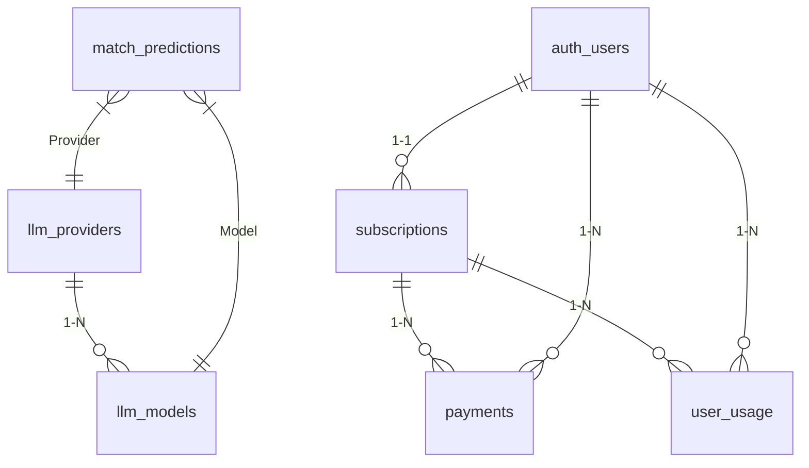
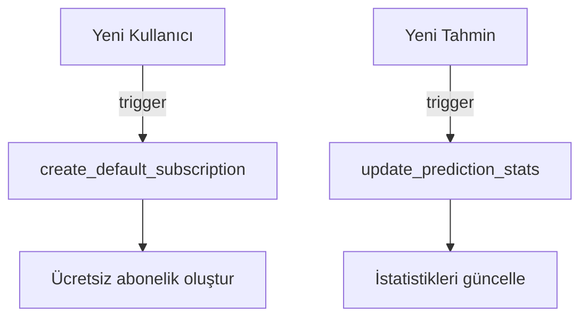
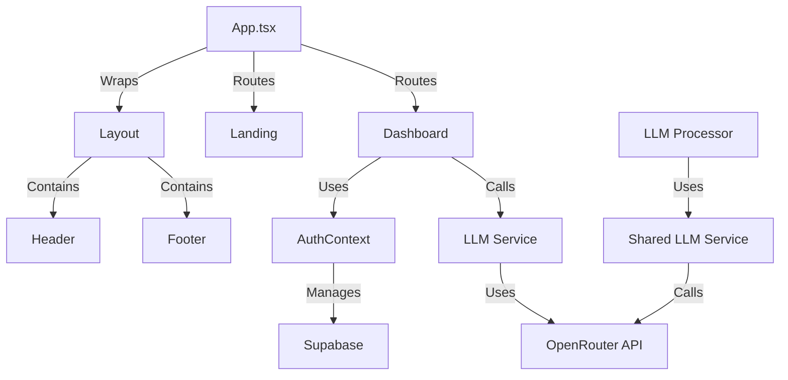
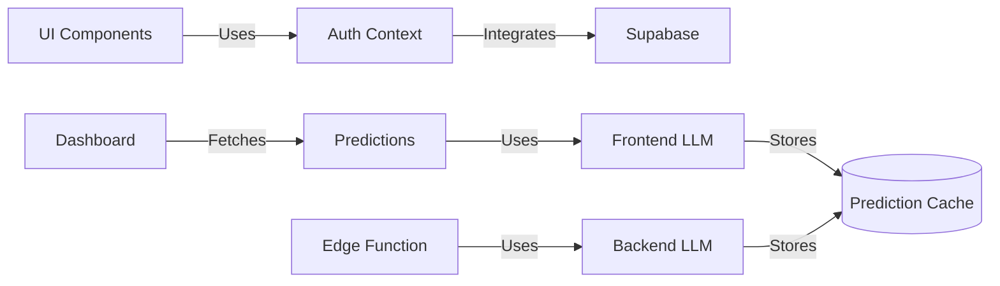

# ScoreResultsAI Teknik Analiz Raporu

## 1. Ana Uygulama Yapısı (`src/App.tsx`)
```typescript
import { BrowserRouter, Routes, Route } from 'react-router-dom'
import { ThemeProvider } from 'next-themes'
import Layout from './components/Layout'
// Diğer importlar...
```

### Temel Özellikler:
- **Routing Sistemi**: 12+ route tanımı içeren merkezi yönlendirme
- **Provider Entegrasyonu**:
  - `ThemeProvider`: Dark/Light tema desteği
  - `AuthProvider`: Kullanıcı kimlik doğrulama
- **Global Bileşenler**:
  - `Toaster` bildirim sistemi
  - `Layout` wrapper'ı

### Route Yapısı:
```tsx
<Routes>
  <Route path="/" element={<Landing />} />
  <Route path="/dashboard" element={<Dashboard />} />
  <Route path="/match/:id" element={<MatchDetail />} />
  <Route path="/admin" element={<AdminPanel />} />
  // Diğer route'lar...
</Routes>
```

## 2. Layout Bileşeni (`src/components/Layout.tsx`)
```typescript
const Layout = ({ children }: LayoutProps) => {
  const { user } = useAuth()
  // State yönetimi...
```

### Temel İşlevler:
- **Responsive Tasarım**:
  - Mobil/Desktop navigasyon geçişi
  - Dinamik menu toggle
- **Auth Entegrasyonu**:
  ```tsx
  {user ? (
    <Button onClick={handleSignOut}>Çıkış</Button>
  ) : (
    <Button onClick={() => navigate('/auth')}>Giriş</Button>
  )}
  ```
- **Tema Yönetimi**:
  ```tsx
  <Button onClick={() => setTheme(theme === 'dark' ? 'light' : 'dark')}>
    {theme === 'dark' ? <Sun /> : <Moon />}
  </Button>
  ```

## 3. Landing Sayfası (`src/pages/Landing.tsx`)
```tsx
const Landing = () => {
  const stats = [...] // İstatistik verileri
  const testimonials = [...] // Kullanıcı yorumları
```

### Bölümler:
1. **Hero Section**:
   - Arka plan görseli ile ana tanıtım
   - CTA butonları (Ücretsiz Dene, AI Özellikleri)
2. **İstatistikler**:
   ```tsx
   {stats.map((stat) => (
     <div key={stat.label}>
       <stat.icon />
       <div>{stat.value}</div>
     </div>
   ))}
   ```
3. **AI Özellik Kartları**:
   - 6 farklı AI özelliğinin görsel tanıtımı
4. **Lig Gösterimi**:
   - 20+ lig logosu ve detayları
5. **Kullanıcı Yorumları**:
   - 3 farklı kullanıcı testimonial'ı

## 4. Dashboard Bileşeni (`src/pages/Dashboard.tsx`)
```typescript
const Dashboard = () => {
  const { user } = useAuth()
  const { prediction, getPrediction } = usePrediction()
```

### Ana Özellikler:
- **Kullanıcı İstatistikleri**:
  ```tsx
  const [stats, setStats] = useState({
    todayMatches: 0,
    activePredictions: 0,
    accuracyRate: 0,
    totalLeagues: 0
  })
  ```
- **Maç Listeleme**:
  ```tsx
  <Tabs>
    <TabsList>
      <TabsTrigger value="today">Bugün</TabsTrigger>
      <TabsTrigger value="live">Canlı</TabsTrigger>
    </TabsList>
  </Tabs>
  ```
- **Tahmin Sistemi**:
  ```tsx
  const handlePredictionSubmit = async () => {
    await getPrediction({
      homeTeam,
      awayTeam,
      leagueName,
      matchDate
    })
  }
  ```

## 5. Auth Sistemi (`src/contexts/AuthContext.tsx`)
```typescript
interface AuthContextType {
  user: User | null
  signIn: (email: string, password: string) => Promise<any>
  signUp: (email: string, password: string) => Promise<any>
  signOut: () => Promise<void>
}
```

### Temel İşleyiş:
1. **Supabase Entegrasyonu**:
   ```tsx
   const { data: { user } } = await supabase.auth.getUser()
   ```
2. **Auth Listener**:
   ```tsx
   supabase.auth.onAuthStateChange((_event, session) => {
     setUser(session?.user || null)
   })
   ```
3. **Auth Metodları**:
   - `signIn`: Email/şifre ile giriş
   - `signUp`: Yeni kullanıcı kaydı
   - `signOut`: Oturum kapatma

## 6. LLM Servis Mimarisi

### 6.1 Frontend LLM Servisi (`src/services/llmService.ts`)
- **Temel İşlevler**:
  - Provider failover sistemi (öncelik sırası)
  - JSON yanıt doğrulama
  - Önbellek yönetimi
  - Prompt oluşturma
  
- **Prediction Akışı**:
  ```mermaid
  graph TD
    A[Başla] --> B[Önbellek Kontrolü]
    B -->|Cache varsa| C[Önbellekten döndür]
    B -->|Cache yoksa| D[Prompt Oluştur]
    D --> E[LLM API Çağrısı]
    E --> F[JSON Ayrıştırma]
    F --> G[Doğrulama]
    G --> H[Veritabanına Kaydet]
    H --> I[Sonucu Döndür]
  ```

### 6.2 Paylaşılan LLM Servisi (`supabase/functions/_shared/llmService.ts`)
- **Temel İşlevler**:
  - Çoklu API anahtarı yönetimi
  - Farklı modeller için destek
  - Konsensüs tahmin sistemi
  - Detaylı futbol analiz prompt'u
  
- **Özellikler**:
  - 4 yedekli API anahtarı
  - Model performans izleme
  - Risk seviyesi analizi
  - Token kullanım takibi

### 6.3 LLM Sorgu İşlemcisi (`supabase/functions/llm-query-processor/index.ts`)
- **Temel İşlevler**:
  - HTTP endpoint for prediction requests
  - CORS desteği
  - İşlem süresi metriği
  - Otomatik provider güncelleme

- **Endpoint Akışı**:
  ```mermaid
  sequenceDiagram
    Frontend->>+LLM Processor: POST /match-prediction
    LLM Processor->>+DB: Aktif provider'ları al
    DB-->>-LLM Processor: Provider listesi
    LLM Processor->>+OpenRouter: API Çağrısı
    OpenRouter-->>-LLM Processor: Tahmin yanıtı
    LLM Processor->>+DB: Sonucu kaydet
    DB-->>-LLM Processor: Kayıt onayı
    LLM Processor-->>-Frontend: Tahmin sonucu
  ```

## 7. Veritabanı Şeması

### Ana Tablolar ve İlişkileri:


### Tablo Özetleri:
1. **llm_providers**:
   - LLM servis sağlayıcıları (OpenRouter vb.)
   - API anahtarları, öncelik seviyeleri ve kullanım istatistikleri
   - `status`: aktif/pasif/hata durumu

2. **llm_models**:
   - Her provider'a ait AI modelleri
   - Maliyet, token limiti ve performans metrikleri
   - `is_default`: varsayılan model işareti

3. **match_predictions**:
   - Maç tahmin önbelleği
   - Kazanan tahmini, gol sayıları, risk seviyesi
   - `cache_expires_at`: 7 gün önbellekleme
   - JSONB alanları: form_analysis, head_to_head

4. **subscriptions**:
   - Kullanıcı abonelikleri (ücretsiz/basic/pro)
   - Stripe entegrasyon detayları
   - Günlük/aylık tahmin limitleri

5. **payments**:
   - Ödeme geçmişi
   - Stripe ödeme kimlikleri ve faturalama detayları
   - `amount`: Kuruş cinsinden fiyat

6. **user_usage**:
   - Kullanıcı aktivite takibi
   - Tahmin istekleri, önbellek isabetleri, token kullanımı
   - Günlük istatistikler

7. **admin_logs**:
   - Yönetimsel eylemlerin kaydı
   - Eylem tipi, kaynak ve sonuç detayları

8. **batch_runs**:
   - Toplu işlemler (haftalık tahminler vb.)
   - İşlem durumu ve istatistikleri

### Performans Optimizasyonları:
- `match_predictions` tablosu için 5 farklı index
- Kullanıcı verileri için bileşik indexler
- Satır seviyesinde güvenlik (RLS) politikaları
- Otomatik timestamp güncelleme trigger'ları

### Önemli Fonksiyonlar:
- `get_user_limits()`: Kullanıcının anlık limit durumunu hesaplar
- `update_updated_at_column()`: Değişiklik zamanını otomatik günceller

Bu şema futbol tahmin sistemi için gerekli tüm verileri yönetir ve ölçeklenebilir bir yapı sunar.

## 8. Veritabanı Trigger ve Fonksiyonları

### Temel Fonksiyonlar:
1. **cleanup_expired_cache()**:
   - Süresi dolmuş tahminleri temizler
   - İstatistikleri günceller
   - Günlük cron job ile çalıştırılır

2. **increment_user_usage()**:
   - Kullanıcı aktivitelerini takip eder
   - Tahmin isteği ve API çağrılarını kaydeder
   ```sql
   INSERT INTO user_usage ... ON CONFLICT DO UPDATE ...
   ```

3. **check_user_daily_limit()**:
   - Kullanıcının günlük limit durumunu kontrol eder
   - Kalan tahmin sayısını hesaplar

4. **refresh_admin_stats()**:
   - Yönetici istatistiklerini günceller
   - Kullanıcı dağılımı, model kullanımı gibi metrikleri içerir

### Otomatik Trigger'lar:


1. **create_default_subscription**:
   - Yeni kullanıcı kaydında otomatik ücretsiz abonelik oluşturur
   - `auth_users` tablosuna AFTER INSERT trigger

2. **update_prediction_stats**:
   - Yeni tahmin eklendiğinde istatistikleri yeniler
   - `match_predictions` tablosuna AFTER INSERT trigger

### Yardımcı Görünümler:
- **active_subscriptions**: Aktif abonelikler ve kullanıcı bilgileri
- **daily_usage_summary**: Günlük kullanım özeti
- **cache_efficiency**: Önbellek performans metrikleri
- **provider_performance**: LLM sağlayıcı karşılaştırması

### Zamanlanmış Görevler:
- `cleanup_expired_cache()`: Günlük 03:00'te çalışır
- `refresh_admin_stats()`: Saatlik olarak çalışır

Bu trigger ve fonksiyonlar veri bütünlüğünü sağlar ve operasyonel süreçleri otomatize eder.

## 9. Seed Data ve İlk Kurulum

### Temel Veri Yapılandırması:
```sql
-- 4 yedekli OpenRouter sağlayıcı
INSERT INTO llm_providers (name, api_endpoint, api_key_encrypted, priority) VALUES
('OpenRouter_Primary', 'https://...', 'sk-or-v1-...', 1),
('OpenRouter_Backup1', 'https://...', 'sk-or-v1-...', 2),
('OpenRouter_Backup2', 'https://...', 'sk-or-v1-...', 3),
('OpenRouter_Backup3', 'https://...', 'sk-or-v1-...', 4);

-- Her provider için 12 model
INSERT INTO llm_models (provider_id, model_name, display_name) VALUES
(provider_id, 'deepseek/deepseek-r1', 'DeepSeek R1'),
(provider_id, 'mistralai/mistral-small', 'Mistral Small');
```

### Sistem Konfigürasyonları:
```sql
INSERT INTO system_config (key, value) VALUES
('subscription_plans', '{"free": {"daily_limit":5}, "basic": {"daily_limit":50}}'),
('prediction_leagues', '{"supported_leagues": ["Premier League", "Süper Lig"]}'),
('llm_prompt_templates', '{"football_prediction_v1": {...}}');
```

### Örnek Abonelik Planları:
| Plan    | Günlük Limit | Aylık Limit | Özellikler                  |
|---------|--------------|-------------|-----------------------------|
| Ücretsiz| 5            | 150         | Temel tahminler             |
| Temel   | 50           | 1500        | Tüm ligler, Email bildirim  |
| Pro     | 200          | 6000        | API erişimi, Özel raporlar  |

### Demo Veriler:
```sql
-- Örnek maç tahminleri
INSERT INTO match_predictions (match_id, home_team, away_team, league_name, ...) VALUES
('demo_match_1', 'Manchester City', 'Liverpool', 'Premier League', ...),
('demo_match_2', 'Galatasaray', 'Fenerbahçe', 'Süper Lig', ...);

-- Sistem log kayıtları
INSERT INTO admin_logs (action, details) VALUES
('system_initialization', 'Database seeded successfully');
```

Bu seed verileri sistemin temel çalışma yapısını oluşturur ve test ortamında kullanıma hazır hale getirir.

## 10. Servisler ve Yardımcı Fonksiyonlar

### subscriptionService.ts
- **Amaç**: Abonelik planlarını yönetir ve plan detaylarını sağlar
- **Plan Detayları**:
  ```typescript
  interface PlanDetails {
    id: string; // 'free', 'basic', 'pro'
    name: string; // Kullanıcı dostu isim
    price: number; // TRY cinsinden
    currency: string; // 'TRY'
    features: string[]; // Plan özellik listesi
    dailyPredictions: number; // Günlük tahmin limiti
    popular?: boolean; // Öne çıkan plan
  }
  ```
- **Temel Fonksiyon**:
  ```typescript
  export function getPlanDetails(planId: string): PlanDetails | null {
    return SUBSCRIPTION_PLANS.find(plan => plan.id === planId) || null
  }
  ```

### supabase.ts
- **Amaç**: Supabase istemcisini başlatır ve auth işlemlerini yönetir
- **Temel Özellikler**:
  - `supabase` istemci örneği oluşturma
  - Kullanıcı yönetimi fonksiyonları:
    - `getCurrentUser()`: Oturum açmış kullanıcıyı getirir
    - `signUp(email, password)`: Yeni kullanıcı kaydı
    - `signIn(email, password)`: Kullanıcı girişi
    - `signOut()`: Oturumu kapatma
  - Abonelik yönetimi:
    - `getUserSubscription(userId)`: Kullanıcı abonelik bilgileri
    - `getUserUsage(userId, date)`: Kullanıcı kullanım istatistikleri

### utils.ts
- **Amaç**: Yardımcı fonksiyonlar sağlar
- **Temel Fonksiyon**:
  ```typescript
  export function cn(...inputs: ClassValue[]) {
    return twMerge(clsx(inputs));
  }
  ```
  - `clsx` ve `tailwind-merge` kullanarak dinamik CSS sınıfı oluşturma
  - Bileşenlerde koşullu stil uygulamalarını basitleştirir

## 11. Sabitler ve Tipler

### features.ts
- **Amaç**: AI özelliklerini tanımlar ve yönetir
- **Temel Yapı**:
  ```typescript
  interface AIFeature {
    id: string; // Özellik slug'ı
    title: string; // Görünen ad
    description: string; // Kısa açıklama
    image: string; // Görsel yolu
    color: string; // Renk gradienti
    icon: string; // Emoji ikonu
    benefits: string[]; // Fayda listesi
  }
  ```
- **Örnek Özellikler**:
  - Veri Analizi
  - Makine Öğrenimi
  - Strateji Analizi
  - Derin Öğrenme
  - Performans Takibi
  - Tahmin Analitiği
  - Büyük Veri
  - Canlı Analiz

### leagues.ts
- **Amaç**: Desteklenen ligleri tanımlar
- **Temel Yapı**:
  ```typescript
  interface League {
    id: string; // Lig slug'ı
    name: string; // Tam adı
    country: string; // Ülke
    logo: string; // Logo yolu
    color: string; // Renk gradienti
    description: string; // Kısa açıklama
  }
  ```
- **Desteklenen Ligler**:
  - Premier League
  - Süper Lig
  - Şampiyonlar Ligi
  - Bundesliga
  - Serie A
  - La Liga
  - Ligue 1
  - Europa League

### matches.ts
- **Amaç**: Maç verilerini tanımlar ve demo veriler sağlar
- **Temel Yapı**:
  ```typescript
  interface Match {
    id: string; // Maç ID
    homeTeam: string; // Ev sahibi
    awayTeam: string; // Deplasman
    homeLogo: string; // Ev logosu (emoji)
    awayLogo: string; // Deplasman logosu (emoji)
    date: string; // Tarih
    time: string; // Saat
    league: string; // Lig adı
    leagueId: string; // Lig ID
    status: 'scheduled' | 'live' | 'finished'; // Durum
    prediction: { // Tahmin detayları
      homeWin: number;
      draw: number;
      awayWin: number;
      confidence: number;
    };
    aiAnalysis: { // AI analizi
      summary: string;
      keyFactors: string[];
      riskLevel: 'low' | 'medium' | 'high';
    };
  }
  ```

### types/index.ts
- **Amaç**: Tüm proje için tip tanımlamaları sağlar
- **Temel Tipler**:
  ```typescript
  // Kullanıcı tipi
  interface User {
    id: string;
    email: string;
    name: string;
    plan: 'free' | 'premium' | 'pro';
    // ...
  }

  // Tahmin tipi
  interface Prediction {
    id: string;
    matchId: string;
    userId: string;
    prediction: 'home' | 'draw' | 'away';
    // ...
  }

  // Canlı maç veri tipi
  interface LiveMatchData {
    id: string;
    minute: number;
    events: MatchEvent[];
    stats: {
      possession: { home: number; away: number };
      // ...
    };
  }
  ```

## 12. Hook'lar ve Özel Fonksiyonlar

### usePrediction.ts
- **Amaç**: Tahmin işlemlerini yöneten merkezi hook
- **Temel İşlevler**:
  ```typescript
  // Tahmin alma (matchId veya takım bilgileriyle)
  const getPrediction = async (request: PredictionRequest) => { ... }

  // Kullanıcı limit kontrolü
  const checkUserLimits = async () => { ... }

  // Önbellek durumu kontrol
  const checkCacheStatus = async (matchId: string) => { ... }
  ```
- **Dönen Değerler**:
  - `loading`: Yükleme durumu
  - `prediction`: Tahmin verisi
  - Yardımcı fonksiyonlar:
    - `formatConfidence()`: Güven yüzdesini metne çevirir
    - `getRiskColor()`: Risk seviyesine göre renk döndürür
    - `formatPredictionText()`: Tahmini okunabilir metne dönüştürür

- **Entegrasyon Örneği**:
  ```typescript
  const { getPredictionByMatchId, prediction, loading } = usePrediction()
  
  useEffect(() => {
    const fetchPrediction = async () => {
      const result = await getPredictionByMatchId('demo_match_1')
      if (result) {
        // Tahmin verisini işle
      }
    }
    fetchPrediction()
  }, [])
  ```

- **Önemli Özellikler**:
  - Supabase Edge Functions ile entegrasyon
  - Kullanıcı limit yönetimi
  - Önbellek öncelikli tahmin alma
  - Hata yönetimi ve bildirim sistemi
  - Responsive tasarım desteği

### useToast.ts
- **Amaç**: Bildirim sistemi için kullanıcı dostu toast mesajları sağlar
- **Temel Özellikler**:
  - `toast()`: Yeni bildirim oluşturur
  - `dismiss()`: Bildirimi kapatır
  - `update()`: Mevcut bildirimi günceller
- **Teknik Detaylar**:
  ```typescript
  // Bildirim durum yönetimi için reducer
  const reducer = (state: State, action: Action): State => {
    // ADD_TOAST, UPDATE_TOAST, DISMISS_TOAST, REMOVE_TOAST
  }
  
  // Bildirim kuyruğu yönetimi
  const addToRemoveQueue = (toastId: string) => { ... }
  ```
- **Sınırlamalar**:
  - Aynı anda maksimum 1 bildirim gösterimi (TOAST_LIMIT)
  - Otomatik kapanma süresi: 1000 saniye (TOAST_REMOVE_DELAY)
- **Entegrasyon**:
  ```typescript
  const { toast } = useToast()
  toast({
    title: "Başarılı",
    description: "Tahmin başarıyla alındı",
  })
  ```

### use-mobile.tsx
- **Amaç**: Responsive tasarım için mobil cihaz kontrolü sağlar
- **Temel İşlev**:
  ```typescript
  const isMobile = useIsMobile() // true/false döndürür
  ```
- **Teknik Detaylar**:
  - 768px breakpoint'ini kullanır (MOBILE_BREAKPOINT)
  - Pencere boyutu değişikliklerini dinler
  - İlk render'da ve boyut değişiminde state'i günceller
- **Kullanım Örneği**:
  ```tsx
  const isMobile = useIsMobile()
  return (
    <nav>
      {isMobile ? <MobileMenu /> : <DesktopMenu />}
    </nav>
  )
  ```


## Teknik Mimari Özeti


Bu dokümantasyon projenin teknik yapısını ve bileşenler arası ilişkileri detaylı şekilde özetlemektedir.