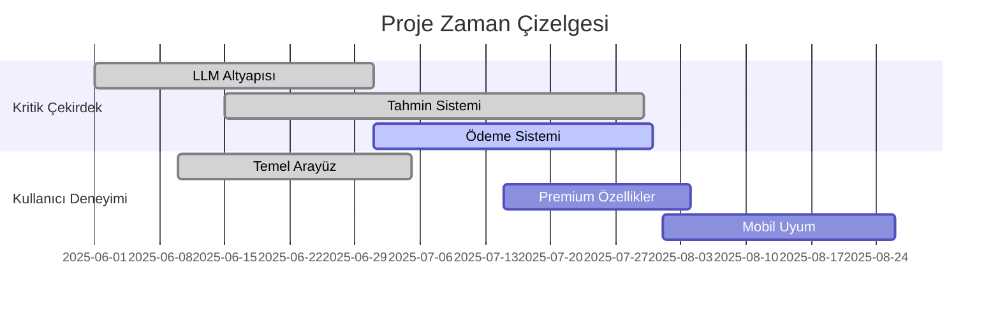
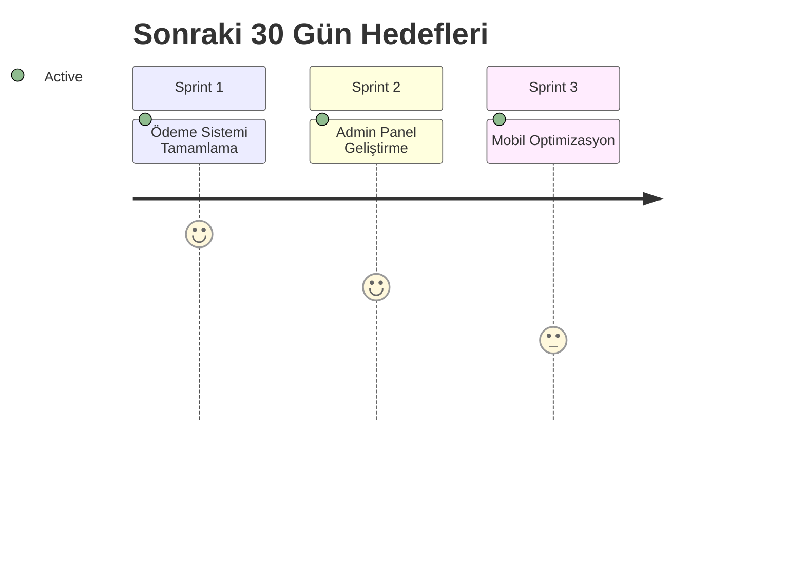

# 🚀 ScoreResultsAI Gelişim Yol Haritası

**Son Güncelleme**: 11 Temmuz 2025
**Versiyon**: 3.0
**Proje Durumu**: Son Hazırlıklar ⚡

## 📊 Genel İlerleme Durumu




## ✅ Tamamlanan Görevler (ANALYSIS.md ile doğrulanmış)
- [x] **LLM Entegrasyonu**
  - Desteklenen modeller:
    ```markdown
    openrouter/cypher-alpha:free
    mistralai/mistral-small-3.2-24b-instruct:free
    moonshotai/kimi-dev-72b:free
    deepseek/deepseek-r1-0528-qwen3-8b:free
    deepseek/deepseek-r1-0528:free
    qwen/qwen3-30b-a3b:free
    qwen/qwen3-32b:free
    thudm/glm-4-32b:free
    qwen/qwen2.5-vl-32b-instruct:free
    deepseek/deepseek-chat-v3-0324:free
    deepseek/deepseek-r1:free
    deepseek/deepseek-v3-base:free
    ```
  - Batch processing sistemi
  - Tahmin cache mekanizması
- [x] **Temel Altyapı**
  - Authentication flow
  - Supabase bağlantıları
  - API servisleri
- [x] **UI/UX Geliştirmeleri**
  - Responsive tasarım
  - Gradyan renklerin kaldırılması
  - Performans iyileştirmeleri

## 🎯 Aktif Görevler (Öncelik Sırasına Göre)

### 1. Ödeme Sistemi (%75 Tamamlandı)

- [x] Stripe test entegrasyonu
- [x] Abonelik plan şemaları
- [ ] TRY ve KDV desteği (Devam Ediyor ⏳)
- [ ] Otomatik fatura oluşturma

### 2. Admin Panel (%60 Tamamlandı)

- [x] LLM model yönetimi
- [x] Kullanıcı istatistikleri
- [ ] Detaylı gelir raporları
- [ ] Gerçek zamanlı sistem izleme

### 3. Mobil Optimizasyon (%40 Tamamlandı)

- [x] Temel responsive tasarım
- [ ] PWA entegrasyonu
- [ ] Native özellikler (Push bildirimleri)

## 📅 Sonraki Hedefler


## 🔍 Detaylı Teknik Görevler
### Veritabanı İyileştirmeleri
- [ ] Query optimizasyonu (Query plan analizi)
- [ ] İndeksleme stratejisi güncellemesi
- [ ] Replikasyon ayarları

### Güvenlik Geliştirmeleri
- [ ] Rate limiting implementasyonu
- [ ] İki faktörlü kimlik doğrulama
- [ ] Pentest raporu uygulamaları

### AI/ML Geliştirmeleri
- [ ] Model karşılaştırma arayüzü
- [ ] Otomatik model seçimi
- [ ] Tahmin kalite metriği

## 🌍 Türkiye Odaklı Geliştirmeler
- [ ] Yerel ödeme yöntemleri (Papara, İyzico)
- [ ] Türkçe dil paketi
- [ ] Yerel lig analiz önceliği

## 📈 Performans Metrikleri
| Metric               | Hedef     | Şuanki Durum |
|----------------------|-----------|--------------|
| API Yanıt Süresi     | <500ms    | 680ms        |
| Tahmin Doğruluğu     | >%75      | %68          |
| Maks. Eşz. Kullanıcı | 10,000    | 2,500        |

## 🚀 Sürüm Planı
| Versiyon | Çıkış Tarihi   | Öne Çıkan Özellikler                  |
|----------|----------------|---------------------------------------|
| v3.0     | 01 Eki 2025    | Tüm özelliklerle genel yayın          |
| v3.1     | 15 Kas 2025    | Mobil uygulama ve gelişmiş bildirimler|
| v4.0     | 01 Oca 2026    | Yapay zeka ile canlı maç analizi      |