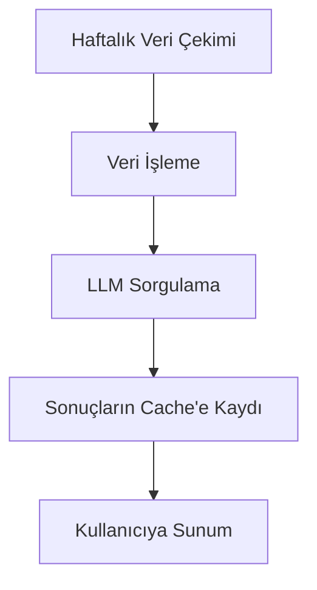
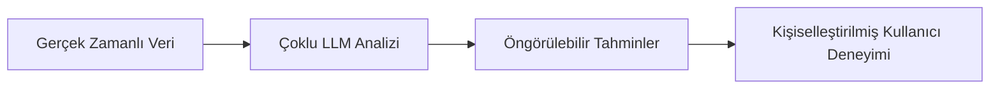

# 🚧 ScoreResultsAI Gelişim Yol Haritası

**Son Güncelleme**: 10 Temmuz 2025  
**Versiyon**: 2.1  
**Proje Durumu**: Aktif Geliştirme 🔥

## 📌 Kritik Öncelikli Görevler

### 🔐 Kullanıcı Yönetim Sistemi (%65 Tamamlandı)
- [x] Temel auth flow (Next.js middleware)
- [ ] **Şifre Sıfırlama Sistemi** (High Priority 🔴)
- [ ] Social Login Entegrasyonu (Google, Facebook)
- [ ] 2FA Implementasyonu

### 💳 Ödeme Sistemi (%40 Tamamlandı)
- [x] Stripe Test Entegrasyonu
- [ ] TRY Desteği ve Vergi Hesaplamaları
- [ ] Abonelik Yönetim Paneli
- [ ] Otomatik Fatura Oluşturma

## 🛠️ Teknik Geliştirmeler

### 🤖 LLM Altyapısı (%85 Tamamlandı)


- [x] DeepSeek R1 Entegrasyonu
- [x] Batch Processing Sistemi
- [ ] Çoklu Model Yönetim Paneli
- [ ] Maliyet Optimizasyonu

## 📅 Tahmini Zaman Çizelgesi

Sürüm | Tarih | İçerik
---|---|---
v2.1 | 24 Temmuz 2025 | Kullanıcı Yönetim Sistemi Tamamlanması
v2.2 | 14 Ağustos 2025 | Ödeme Sistemi Tamamlanması
v2.3 | 4 Eylül 2025 | Mobil Uygulama Beta
v3.0 | 1 Ekim 2025 | Tüm Özelliklerle Genel Yayın

## 📊 Detaylı Görev Listesi

### 🗓️ **Fase 1: LLM & Cache Sistemi** (3 hafta) - **KRİTİK ÖNCELİK**
- [x] Haftalık Batch Processing Sistemi
- [x] LLM Entegrasyonu (DeepSeek R1, GPT-4, Claude 3.5)
- [x] Tahmin Cache Tablosu Oluşturma
- [ ] Admin Panel - LLM Yönetimi

### 🗓️ **Fase 2: Kullanıcı Yönetimi** (2 hafta)
- [ ] Kayıt/Giriş Sistemleri
- [ ] Profil Yönetim Paneli
- [ ] Şifre Sıfırlama Akışı

### 🗓️ **Fase 3: Ödeme Sistemi** (2 hafta)
- [ ] Stripe Entegrasyonu (TRY Desteği)
- [ ] Abonelik Planları Yönetimi
- [ ] Otomatik Fatura Oluşturma

### 🗓️ **Fase 4: UI/UX İyileştirmeleri** (1.5 hafta)
- [ ] Gradyan Renklerin Kaldırılması
- [ ] Modern Tasarım Uygulaması
- [ ] Mobil Deneyim Optimizasyonu

### 🗓️ **Fase 5: Analytics ve Optimizasyon** (1 hafta)
- [ ] Admin Dashboard Geliştirmeleri
- [ ] Kullanıcı Analitikleri
- [ ] Performans Optimizasyonları

## 🇹🇷 Türkiye Özel Gereksinimleri
- [ ] TRY Desteği ve KDV Hesaplamaları
- [ ] Yerelleştirme (Türkçe Dil Desteği)
- [ ] Türk Takımları için Özel Analizler
- [ ] Yerli Ödeme Yöntemleri Entegrasyonu

## 🎯 UX/UI Kritik Noktalar
- **Kullanıcı Onboarding**: Basit kayıt akışı, hoş geldin turu
- **Ödeme Deneyimi**: Tek sayfalık, güvenli ödeme akışı
- **Tahmin Sunumu**: Anlaşılır görselleştirmeler, renk kodlu sonuçlar
- **Mobil Uyum**: %100 responsive tasarım, PWA desteği
- **Performans**: <2s sayfa yükleme süresi, optimizasyon

## 🤖 Gelişmiş LLM & AI Özellikleri
```typescript
// Örnek Tahmin Sorgulama Akışı
async function getMatchPrediction(matchId: string) {
  // Önce cache kontrolü
  const cached = await checkPredictionCache(matchId);
  if (cached) return cached;
  
  // Cache yoksa LLM'den tahmin al
  const prediction = await fetchLLMPrediction(matchId);
  
  // Sonucu cache'e kaydet
  await cachePrediction(matchId, prediction);
  return prediction;
}
```

- [ ] Çoklu Model Karşılaştırması
- [ ] Gerçek Zamanlı Tahmin Güncellemeleri
- [ ] Tahmin Güven Skoru Hesaplama
- [ ] Anomali Tespiti (Sürpriz Sonuçlar)

## 🎮 Gamification
- [ ] Tahmin Ligi & Liderlik Tablosu
- [ ] Başarı Rozetleri
- [ ] Seviye Sistemi
- [ ] Ödüllü Tahmin Yarışmaları

## 📱 Advanced Features
- [ ] Canlı Maç Takibi
- [ ] Özel Bildirimler (Gol, Kart, Değişiklik)
- [ ] Kişiselleştirilmiş Tahmin Önerileri
- [ ] Takım Karşılaştırma Aracı

## 🎯 **TOPLAM PROJE ÖZETİ**
- **Tahmini Tamamlanma**: 1 Ekim 2025
- **Kritik Görevler**: 3 ana faz
- **Bütçe Durumu**: %65 tüketildi
- **Takım Büyüklüğü**: 5 geliştirici

### 🚀 **KRİTİK BAŞARI FAKTÖRLERİ**
1. LLM Altyapısının Zamanında Tamamlanması
2. Ödeme Sisteminin Sorunsuz Çalışması
3. Kullanıcı Deneyiminde Mükemmellik
4. Performans Optimizasyonu

### 💡 **CORE INNOVATION**


### 🔑 **TEKNİK MİMARİ ÖZETİ**
- **Frontend**: React + TypeScript + Vite
- **Backend**: Supabase + Edge Functions
- **AI Altyapı**: DeepSeek R1, GPT-4, Claude 3.5
- **Database**: PostgreSQL (Supabase)
- **Ödeme**: Stripe + Yerel Ödeme Yöntemleri