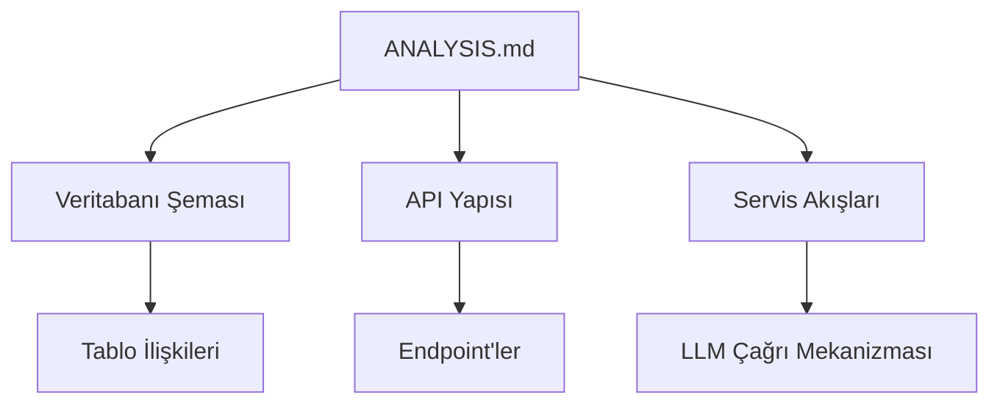

# 🧠 AI Proje Anlama ve İş Akışı Kılavuzu

## 📚 Temel Çerçeve
```markdown
1. **ANALYSIS.md** dosyasını mutlaka oku:
   - Bu dosya projenin "beyin haritası" niteliğindedir
   - Tüm teknik detaylar ve mimari burada belgelenmiştir
   - Özellikle şu bölümlere dikkat et:
     * Veritabanı şeması ve ilişkiler
     * LLM entegrasyon stratejileri
     * Kritik servislerin akış diyagramları
```

## 🔍 Projeyi Anlama Adımları

### 1. Dosya Yapısını Analiz Et


### 2. Kritik Dosyaları İncele
```markdown
- `src/services/llmService.ts`: AI çağrı merkezi
- `src/contexts/AuthContext.tsx`: Kullanıcı yönetimi
- `supabase/functions/`: Edge fonksiyonları
- `src/hooks/usePrediction.ts`: Tahmin mantığı
```

### 3. Bağımlılıkları Haritala
```python
# Örnek bağımlılık analizi
def map_dependencies(file):
    if 'llmService' in file:
        return ['supabase/functions', 'src/types/index.ts']
    elif 'AuthContext' in file:
        return ['src/lib/supabase.ts', 'src/services/subscriptionService.ts']
```

## ⚙️ Görev Çözümleme Adımları

### 1. Görevi Kategorize Et
```markdown
| Kategori      | Örnek Görevler                | İlk Bakılacak Dosyalar       |
|---------------|-------------------------------|------------------------------|
| API Geliştirme| Yeni endpoint ekleme          | `src/services/`, `src/pages/api/` |
| UI Düzenleme  | Bileşen güncelleme            | `src/components/`, `src/pages/` |
| AI Optimizasyon| Model performans iyileştirme | `src/services/llmService.ts`, `supabase/functions/llm-query-processor` |
| Veritabanı    | Şema değişikliği             | `database/`, `supabase/migrations/` |
```

### 2. Context Toplama Stratejisi
```markdown
1. `ANALYSIS.md` ilgili bölümü oku
2. İlgili dosyaları `read_file` ile incele
3. `search_files` ile ilgili fonksiyonları ara:
   <search_files>
   <path>src/services</path>
   <regex>function.*getPrediction</regex>
   </search_files>
4. `list_code_definition_names` ile dosya yapısını anla
```

### 3. Değişiklik Planlama
```markdown
- Küçük değişiklikler için `apply_diff` kullan
- Büyük revizyonlar için `write_to_file` tercih et
- Yeni dosyalar oluştururken `ANALYSIS.md` ile tutarlılık kontrol et
```

## 🛠️ Araç Kullanım Rehberi

### Verimli Okuma İçin:
```markdown
<read_file>
<args>
  <file>
    <path>src/services/llmService.ts</path>
    <line_range>50-100</line_range>
  </file>
  <file>
    <path>ANALYSIS.md</path>
    <line_range>300-350</line_range>
  </file>
</args>
</read_file>
```

### İlişkili Kodları Bulma:
```markdown
<search_files>
<path>src</path>
<regex>usePrediction</regex>
<file_pattern>*.tsx</file_pattern>
</search_files>
```

## 💡 En İyi Uygulamalar

1. **Önce ANALYSİS.md**  
   Her görevde ilk 5 dakikanızı ANALYSIS.md'nin ilgili bölümünü okumaya ayırın

2. **Bağımlılık Haritası Çıkar**  
   Değiştirdiğiniz her dosyanın diğer bileşenlerle ilişkisini not alın

3. **Test Odaklı Düşün**  
   Her değişiklik sonrası şunları kontrol edin:
   - API endpoint testleri
   - UI bileşen davranışları
   - Veritabanı bütünlüğü

4. **Dokümantasyonu Güncelle**  
   Yaptığınız her değişikliği ANALYSIS.md'ye yansıtın

```mermaid
journey
    title AI İş Akışı Döngüsü
    section Görev Al
      ANALYSIS.md Oku: 5: 5
      Kod İncele: 4: 5
      Değişiklik Yap: 5: 5
    section Sonrası
      Test Et: 5: 5
      Dokümantasyon Güncelle: 4: 5