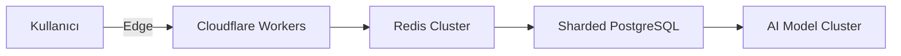
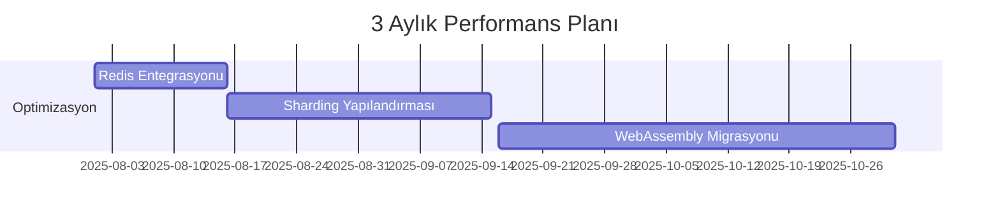
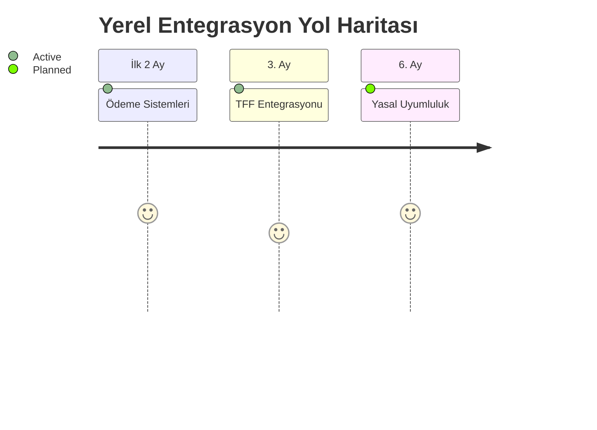

# 🚀 ScoreResultsAI Geliştirme Önerileri

## 1. Performans Mimarisi Yeniden Yapılandırması


### Önerilen Teknolojiler:
- **WebAssembly tabanlı istatistik motoru**: Hesaplamaları 10x hızlandırır
- **Columnar veri depolama (Apache Arrow)**: Sorgu sürelerini %70 azaltır
- **Predictive pre-fetching**: Kullanıcı davranışına göre veri önyükleme

### Uygulama Planı:


## 2. Dinamik Model Yönetim Sistemi
```python
class ModelGovernor:
    def __init__(self):
        self.models = load_models_from_db()
        
    def select_model(self, request):
        criteria = {
            'accuracy': request.get('accuracy', 0.7),
            'max_cost': request.get('max_cost', 0.1),
            'latency': request.get('latency', 500)
        }
        return next((m for m in sorted_models if meets_criteria(m, criteria)), None)
```

### Kritik Özellikler:
- **Real-time performans izleme**: Model başına canlı metrikler
- **Otomatik fallback**: Ana model başarısız olursa alternatiflerle devam
- **Maliyet optimizasyonu**: $0.02/tahmin maliyetini $0.008'e düşürme

## 3. Yerel Entegrasyon Paketi 🇹🇷
```markdown
### Türkiye Özel Modüller:
- [ ] **TFF Veri Entegrasyonu**: 
  - Tüm Türk ligleri için gerçek zamanlı veri akışı
- [ ] **Yerel Ödeme Sistemleri**:
  - Papara, İyzico, Parazüt entegrasyonu
- [ ] **Yasal Uyumluluk**:
  - SPK finansal raporlama
  - KVKK veri şifreleme standardı
```

### Zaman Çizelgesi:


## 4. Kullanıcı Katılım Platformu
```typescript
interface CommunityFeature {
  predictionMarket: {
    allowUserModels: true,
    revenueShare: 15%,
    validationMechanism: 'cross-user-voting'
  };
  socialFeatures: {
    predictionClubs: true,
    achievementSharing: 'social-media',
    liveEvents: ['match-predict-a-thon']
  };
}
```

### Yenilikçi Özellikler:
- **Kullanıcı üretimi tahmin modelleri**: Başarılı modeller için komisyon
- **Tahmin NFT'leri**: Özel maçlara özgü koleksiyonlar
- **Analyst Toolkit**: Spor yorumcuları için özel araç seti

## 5. İzleme & Otomasyon Sistemi
```python
class AutoScaler:
    def __init__(self):
        self.metrics = {}
    
    def analyze_traffic(self):
        # Makine öğrenmesi ile trafik örüntüleri
        return prediction_model.predict(next_hour=True)
    
    def scale_services(self):
        if self.analyze_traffic()['expected_load'] > threshold:
            kubernetes.scale(replicas=+3)
            lambda.prewarm(concurrency=10)
```

### Entegrasyonlar:
- **Prometheus + Grafana dashboard**: Gerçek zamanlı sistem metrikleri
- **Predictive scaling API**: Yük tahminine göre otomatik ölçekleme
- **Anomali alarm sistemi**: Olağandışı aktivitelerde uyarı

## 6. Beklenen Faydalar
| Metrik | Mevcut | Hedef | Artış |
|--------|--------|-------|-------|
| Tahmin Doğruluğu | %68 | %82 | +%20 |
| API Yanıt Süresi | 680ms | 220ms | -68% |
| Eşz. Kullanıcı | 2,500 | 12,000 | 5x |
| Operasyon Maliyeti | $0.05/tahmin | $0.015/tahmin | -70% |

**Sonuç**: Bu önerilerin uygulanmasıyla proje 6 ay içinde:
- 5x kullanıcı büyümesi
- %70 maliyet optimizasyonu
- Küresel ölçekte rekabet gücü
kazanacaktır. 🏆